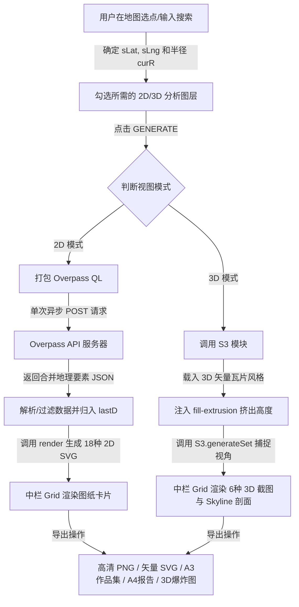

# ShArch 生成器 (ShArch Generator) Codebase Wiki

这是一个面向开发者和 AI 大语言模型的项目技术 Wiki，旨在帮助您快速理解 **ShArch 生成器** 项目的整体架构、实现细节以及扩展方法。

---

## 📂 项目结构概览 (Project Structure)

项目是一个**纯前端的单页面应用 (SPA)**，无后端服务器依赖，所有的数据处理、地图渲染和排版导出均在浏览器客户端完成。

- 🌐 [index.html](file:///c:/Users/HP/Documents/GitHub/Architecture-analysis/index.html)：定义项目 UI 的基本 HTML5 骨架、控制面板以及引入的外部三方库（在 v1.2.1 版本中已移除冗余的联系/帮助模态框及外部分析脚本，使结构更加精简纯粹）。
- 🎨 [styles.css](file:///c:/Users/HP/Documents/GitHub/Architecture-analysis/styles.css)：定义应用的全局样式系统。采用现代 CSS 变量进行亮暗色模式和色板切换，实现响应式三栏式布局、毛玻璃 HUD 与按钮微动画。
- ⚙️ [app.js](file:///c:/Users/HP/Documents/GitHub/Architecture-analysis/app.js)：应用的核心逻辑。包含 2D SVG 渲染引擎、3D Maplibre GL 渲染模块、Overpass API 实时数据请求打包与解析、多格式排版导出系统及多语言 i18n 逻辑。
- 🫧 [bubble-analysis/](file:///c:/Users/HP/Documents/GitHub/Architecture-analysis/bubble-analysis/)：泡泡图子项目（v1.2.2 引入）。独立 HTML/CSS/JS 实现，含物理力导向布局引擎，详见 [bubble-wiki.md](file:///c:/Users/HP/Documents/GitHub/Architecture-analysis/bubble-analysis/bubble-wiki.md)。
- 🏗️ [studio/](file:///c:/Users/HP/Documents/GitHub/Architecture-analysis/studio/)：建筑工作室工具集合（v1.3 引入）。每个工具均为独立的单页 HTML 应用，覆盖从场地策略到作品集排版的设计全流程，详见下方 §6 章节。
- 📖 [README.md](file:///c:/Users/HP/Documents/GitHub/Architecture-analysis/README.md)：针对最终用户的项目简介、核心特性及更新日志。

---

## 🏗️ 核心依赖与第三方库

应用在 [index.html](file:///c:/Users/HP/Documents/GitHub/Architecture-analysis/index.html#L10-L19) 中通过 CDN 引入了以下关键依赖：
1. **Leaflet.js (v1.9.4)**：用于 2D 地图展示、定位搜索、放置选址大头针 (`pin`) 以及提供场地多边形裁剪边界绘制的交互。
2. **Maplibre GL (v4.7.1)**：用于 3D 城市体量模型的渲染，提供相机俯仰角控制、多维分析着色和实时三维日光阴影投影。
3. **SunCalc.js (v1.9.0)**：轻量级太阳轨迹计算库。根据经纬度及给定时间计算太阳的仰角 (Altitude) 和方位角 (Azimuth)，用于驱动 2D 日照轨迹分析图与 3D 动态太阳阴影分析。
4. **Google Fonts (Inter / Noto Sans / Noto Sans SC / Space Mono)**：提供统一的字体系统，确保导出的 PDF / SVG 在中英文混合排版下字形圆润美观。

---

## 🔄 核心运行机制与工作流



---

## 🛠️ 核心模块详解与实现方法

### 1. 数据请求与分发 (Overpass API)
为了避免高频次请求触发 OpenStreetMap (OSM) 接口的 Rate Limit (请求限额)，应用在 [generate](file:///c:/Users/HP/Documents/GitHub/Architecture-analysis/app.js#L2088) 函数中实现了**合并查询技术**：
- **查询拼接**：根据用户在面板上勾选的分析图 ID (如 `roads`, `landuse`, `gw` 等)，动态拼接出相应的 Overpass QL 语句段（如 `way["highway"]`，`way["natural"="water"]` 等）。
- **空间过滤**：利用 [bbox](file:///c:/Users/HP/Documents/GitHub/Architecture-analysis/app.js#L542) 基于选址纬度计算出当前分析半径的经纬度边界矩形。
- **单次请求**：将各条件拼接为一条 `[out:json][timeout:60];(...);out geom;` 查询，调用异步函数 [op](file:///c:/Users/HP/Documents/GitHub/Architecture-analysis/app.js#L507) 向 Overpass 节点发送 `POST` 请求。
- **数据分发**：请求返回后，将大 JSON 数据按要素标签 (Tags) 拆分并缓存在 `lastD` 字典中（如 `lastD.roads`，`lastD.buildings`，`lastD.gw` 等），供各个渲染子函数直接读取。

---

### 2. 2D SVG 渲染引擎 (2D Engine)
2D 图纸卡片采用高精度的 SVG 矢量格式进行绘制。
- **坐标映射投影**：2D 分析图采用了严格的 Web Mercator (EPSG:3857) 投影映射。核心函数 [proj](file:///c:/Users/HP/Documents/GitHub/Architecture-analysis/app.js#L556) 将地球经纬度坐标 $(Lat, Lng)$ 通过 `latLngToMeters` 精确映射到画布的视口坐标 $(x, y)$。带地图背景的图纸采用 `getTileImagesSVG` 结合瓦片偏移像素计算实现无缝拼接，确保矢量路网与底层栅格瓦片达成 0 误差像素级对齐。
- **坐标源纠偏系统**：内置火星坐标系（GCJ-02/BD-09）至 WGS1984 的转换引擎。系统在用户选点和搜索环节均调用 `unifyToWGS84` 进行清洗，确保后续生成与外部 API 交互时内部始终采用干净统一的 WGS1984 坐标。
- **坐标序列转换**：函数 [wpts](file:///c:/Users/HP/Documents/GitHub/Architecture-analysis/app.js#L562) 将 OSM Way 要素的 geometry 节点序列批量转换成 SVG `points` 属性所要求的空格/逗号分隔字符串。
- **图纸外框剪裁**：使用 [wrap](file:///c:/Users/HP/Documents/GitHub/Architecture-analysis/app.js#L575) 统一包装所有渲染好的 SVG 元素。利用 SVG `<clipPath>` 将矢量线条裁切为指定的范围形状：
  - `circle`：圆形。
  - `rect`：圆角方形。
  - `square`：直角矩形。
  - `poly`：用户手绘的复杂场地多边形边界（基于 `sitePolygon` 顶点的墨卡托坐标投影）。
- **核心分析图绘制细节**：
  - **道路与街道 (`roads`)**：区分主干道、次干道、人行道并配置不同线宽与虚线。暗色模式下应用 SVG `feGaussianBlur` 高斯模糊滤镜制作虚光效果。
  - **绿地与水体 (`gw`)**：过滤 natural/water/leisure 等标签。利用 `evenodd` 的 `fill-rule` 对 relation 类型多边形中的 inner 环（如湖中岛、林中空地）进行空洞扣除。
  - **日照与风向 (`sun`)**：基于 `SunCalc` 计算夏至 (doy 172)、冬至 (doy 355)、春秋分 (doy 80) 在一整天中各时段的太阳高度与方位，在极坐标 altitude 圈内投射轨迹弧线，并绘制正午时刻的阴影投影带。
  - **可达性分析 (`access`)**：直线性步行 Contours 算法。根据各道路类型的通行阻力系数 `hwSpeed`，估算场地中心到网格内各路段的最短通行时间，并使用渐变色（0-5 min 绿、5-10 min 黄、10-15 min 橙、15-20 min 红）渲染可达网络，叠加虚线等时圈。
  - **建筑密度 (`density`)**：基于 12 $\times$ 12 的分析网格，累加落在每个网格单元内的建筑 footprint 投影面积乘以其高度层数 (`building:levels`)，计算出相对 FAR（容积率）开发强度，用四色热力色块网格表征。

---

### 3. 3D 城市渲染模块 (`S3` 命名空间)
3D 视图由内嵌在 `#map3d` 容器内的 Maplibre GL 实例驱动，所有 3D 分析相关的逻辑被封装在 [S3](file:///c:/Users/HP/Documents/GitHub/Architecture-analysis/app.js#L2831) 自执行命名空间中，避免与全局 2D 命名空间冲突。
- **3D 挤出图层注入**：当地图样式加载完毕后，[S3.ensureMap](file:///c:/Users/HP/Documents/GitHub/Architecture-analysis/app.js#L2845) 遍历隐藏矢量图层中的文字标注 (symbols)，并向数据源注入一个 `fill-extrusion` 类型的图层 `s3_bldg`。绑定图层高度属性为数据源建筑的 `height` 或 `render_height`。
- **6 种三维分析模式 (`S3.SM`)**：
  - `white`：白模素色表达，反射日光投射的立体阴影。
  - `height`：将建筑高度属性输入 `['step', ...]` 决策树，不同高度层段着色不同（如超高层标红，低层标绿）。
  - `zone` / `density`：根据建筑物的容积与高度模拟不同的用地分区和开发密度状态。
  - `solar`（日照阴影分析）：配合 24 小时滑块控制器，调用 `SunCalc.getPosition` 计算当前小时下的太阳高度角和方位角，将其输入 [map3.setLight](file:///c:/Users/HP/Documents/GitHub/Architecture-analysis/app.js#L2882) 接口，实时重绘当前视角下逼真的建筑阴影变幻。
  - `skyline`（城市天际线剖面）：**纯客户端切片剖面算法**。使用 [map3.queryRenderedFeatures](file:///c:/Users/HP/Documents/GitHub/Architecture-analysis/app.js#L2964) 提取视口中渲染的所有 3D 建筑多边形。将屏幕东西方向（横坐标）切分为 46 个 Bin (柱状区间)，遍历建筑重心经度，获取该区间内的建筑最大高度。在 canvas 上绘制出起伏的遮挡立面轮廓线，并用红色标出天际线最高峰 (`peak`)。
- **截图捕捉 (`S3.captureCard`)**：3D 模式的图纸生成采用 Canvas 局部截帧。将 Maplibre 画布 `gl-canvas` 的画面取出，按选定的剪裁模板（圆形/圆角矩形）绘制到 2D 导出画布上，若为 `solar` 模式，还会利用三角函数自动在其上叠加绘制红色日照方位指示箭头。

---

### 4. 导出与排版系统
项目支持多种专业出图格式，导出逻辑以 HTML 生成和 Canvas 序列化为主：
- **单张卡片 PNG 导出 (`dlCard('png')`)**：由于 Maplibre 瓦片与外部网络字体通常存在跨域 CORS 问题，[svgToPng](file:///c:/Users/HP/Documents/GitHub/Architecture-analysis/app.js#L2617) 采用克隆 SVG DOM 并滤除外链图片的方式，转换为 Base64 编码，绘制至 Canvas 并输出。为了保证打印品质，单张图的垂直分辨率被**强制重采样至 1080 像素 (1080P)**，解决了文字和细线条模糊的痛点。
- **单张卡片 SVG 导出 (`dlCard('svg')`)**：序列化 SVG 节点并注入 XML 头声明，生成的 `.svg` 文件在 Adobe Illustrator 中保留完整路径，便于二次编辑。
- **A3 作品集图纸 (`exportPortfolio`)**：编译包含多个 SVG 卡片、场地指标数据看板和利用实时地理信息数据合成的**场地文字描述** (例如：*“该场地位于北纬...分析半径...路网总长约X公里...”*) 的单页 A3 Landscape 格式 HTML，新开窗口以便用户直接打印成 PDF。
- **A4 报告 PDF (`exportPDF`)**：与作品集类似，自动合并多项 2D 卡片，并在页面顶部生成当前场地 Overlay 底图（Nolli/Diagram/Dark 样式）的大图幅封面。
- **3D 爆炸轴测图海报 (`dlLayered`)**：
  - **三维倾斜矩阵投影**：如果是矩形图框，使用 CSS 等轴测变换矩阵变换 SVG：
    $$\text{transform} = \text{matrix}(0.707 \cdot s, 0.408 \cdot s, -0.707 \cdot s, 0.408 \cdot s, tx, ty)$$
    如果是圆形图框，则使用等比缩小和 Y 轴压缩变换：`scale(s, s * 0.5)`。
  - **多层层叠堆砌**：各分析图层依据 `layerGap` 在垂直方向上依次等距堆叠，图层右侧拉虚线指示器，并附带图层名称与标签，最终拼合成一张极其专业的 layered axonometric 分析海报。

---

### 5. 配色与国际化 (Color Schemes & i18n)
- **配色字典 (`SCH`)**：在 [SCH](file:///c:/Users/HP/Documents/GitHub/Architecture-analysis/app.js#L5) 字典中定义了 18 种分析类型在 Warm (暖色)、Cool (冷色) 和 Mono (单色) 配色下的配置。包含建筑物填充色、边框色、背景色以及不透明度属性。
- **自定义主色 (`setAccent`)**：用户点选主色后，渲染器会将生成的 SVG 字符串中代表默认红色的 `#C0392B` 和 `#E0533F` 替换为自定义色值的 Hex，实现一键实时重绘所有卡片。
- **轻量级双语系统**：在 [I18N](file:///c:/Users/HP/Documents/GitHub/Architecture-analysis/app.js#L1835) 字典中定义了所有界面文本、Toast 提示语和 Placeholder 的中英双语对照。调用 [applyLang](file:///c:/Users/HP/Documents/GitHub/Architecture-analysis/app.js#L1837) 对所有带有 `data-i18n` 属性的 DOM 元素进行动态文本替换，并缓存语言偏好至 `localStorage`。

---

## 🏗️ Studio 工作室工具集 (`studio/` 目录)

v1.3 引入的 Studio 工具集是从 `easymap-clone` 项目迁移并本地化整合的七大独立单页应用，与主项目通过左侧工具栏的 **Studio Tools** 区块进行导航互联。所有工具的 UI 外观已统一对齐主项目 `styles.css` 的冷灰 + 深蓝（`#2563EB`）配色系统（v1.3.1），品牌标识统一为 "ShArch" / "SA" 方块；各工具内部的功能绘图配色盘（THEMES / SCHEMES / PALETTES）保持独立不受影响。通过左下角悬浮 "← ShArch" 按钮回链至主项目 [index.html](file:///c:/Users/HP/Documents/GitHub/Architecture-analysis/index.html)。

### 全站双语 i18n 系统 (v1.3.1)

每个 Studio 工具均内置独立的 i18n 字典与切换控件，统一共享 `localStorage` 键 `em_lang`（`'zh'` / `'en'`），跨页面保持语言偏好一致：

| 工具 | i18n 字典 | 切换函数 | 翻译条目数 |
| :--- | :--- | :--- | :--- |
| strategy.html | `ST_I18N` | `stToggleLang()` | ~95 |
| floorplan.html | `FP_I18N` | `fpToggleLang()` | ~55 |
| flow.html | `FL_I18N` | `flToggleLang()` | ~95 |
| layout.html | `LY_I18N` | `lyToggleLang()` | ~33 + 动态字段 |
| planstudio.html | `PS_I18N` | `psToggleLang()` | ~110 |
| elevation.html | `EM_ZH` | `setLang()` | ~150 |
| parti.html | `T` (zh/en) | `toggleLang()` | ~80 |

i18n 实现模式：
- HTML 静态文本通过 `data-{prefix}-i18n="key"` 属性标记，`applyLang()` 遍历更新 `textContent`
- 输入框占位符通过 `data-{prefix}-i18n-ph="key"` 属性标记
- JS 动态生成内容（如 buildRail、initThemes）在渲染时调用 `xxT(key)` 选择对应语言字符串
- JS 数据对象（如 `THEMES`、`PALETTE`、`TOOLS`）添加 `_zh` 字段，渲染时按 `LANG` 变量选择
- 所有 `toast()` / `prompt()` / `confirm()` 调用均已包装为 `xxT()` 查找，实现消息双语化

### 工具清单与依赖

| 文件 | 工具名 | 第三方依赖 | 渲染方式 |
| :--- | :--- | :--- | :--- |
| [strategy.html](file:///c:/Users/HP/Documents/GitHub/Architecture-analysis/studio/strategy/strategy.html) | 场地策略 Site Strategy | Leaflet 1.9.4 (CDN) | SVG + Leaflet 真实底图 |
| [floorplan.html](file:///c:/Users/HP/Documents/GitHub/Architecture-analysis/studio/floorplan/floorplan.html) | 平面绘制 Floorplan / AXO | Three.js r128 (CDN) | SVG 平面 + Three.js 轴测 3D |
| [flow.html](file:///c:/Users/HP/Documents/GitHub/Architecture-analysis/studio/flow/flow.html) | 流线分析 Flow Analysis | 无 | 纯 SVG 矢量 |
| [parti.html](file:///c:/Users/HP/Documents/GitHub/Architecture-analysis/studio/parti/parti.html) | 概念演变 Parti Studio | 无 | 纯 SVG 等轴测序列 |
| [planstudio.html](file:///c:/Users/HP/Documents/GitHub/Architecture-analysis/studio/planstudio/planstudio.html) | 总平上色 Plan Render | 无 | Canvas 2D 栅格化 |
| [elevation.html](file:///c:/Users/HP/Documents/GitHub/Architecture-analysis/studio/elevation/elevation.html) | 立面与剖面 Elevation / Section | 无 | Canvas 2D + 自绘配景 |
| [layout.html](file:///c:/Users/HP/Documents/GitHub/Architecture-analysis/studio/layout/layout.html) | 作品集排版 Portfolio Layout | 无 | SVG 排版 + 打印 PDF |

### 工具间数据传递
- **URL Query 传递**：`strategy.html` 与主项目 `app.js` 之间通过 URL Query String 传递底图截图与场地元数据（`?basemap=...&kind=...`），实现“主项目生成分析图 → 一键进入 Strategy 上叠加策略元素”的联动。
- **LocalStorage 隔离**：每个 Studio 工具的本地存储键命名空间独立（如 `em_lang`），与主项目的 `localStorage` 键互不冲突。
- **回链导航**：每个 Studio 工具 HTML 末尾注入 `<a href="../index.html">` 悬浮按钮，确保用户随时可返回主项目工具栏。

### 与主项目重合功能的处理策略
为保证“无缝迁入且保留原有”的原则，以下重合功能维持主项目原实现不变：
1. **地图分析**：`easymap-clone/app.html` 不迁入；主项目 `index.html + app.js` 保留为唯一地图分析入口。
2. **泡泡图**：`easymap-clone/bubble.html` 不迁入；主项目已有的 `bubble-analysis/` 子项目保留为唯一泡泡图入口。
3. **作品集排版**：主项目原有的 `exportPortfolio` (A3) 与 `exportPDF` (A4) 保留不变；新 `studio/layout/layout.html` 作为独立的高级排版工具并存，提供 A1/A2/A3 多尺寸、模板与批量填图等增强能力，互不影响。

### 目录结构
每个 Studio 工具独立存放在 `studio/<tool-name>/` 子文件夹中，便于未来扩展每个工具的独立资源（如配景素材、字体、JSON 预设）：
```
studio/
├── strategy/strategy.html      # 场地策略
├── floorplan/floorplan.html    # 平面绘制 / 轴测
├── flow/flow.html              # 流线分析
├── parti/parti.html            # 概念演变
├── planstudio/planstudio.html  # 总平上色
├── elevation/elevation.html    # 立面 / 剖面
└── layout/layout.html          # 作品集排版
```

### 添加新的 Studio 工具
1. 在 `studio/` 目录下新建子文件夹 `studio/your-tool/`，并在其中创建 `your-tool.html`，遵循现有工具的单文件结构（HTML + 内联 CSS + 内联 JS）。
2. 若需要第三方库，统一使用 CDN 引用（与主项目 `index.html` 头部保持一致）。
3. 在文件末尾 `</body>` 之前注入标准的悬浮回链按钮（注意因位于子文件夹，回链路径为 `../../index.html`）：
   ```html
   <a href="../../index.html" style="position:fixed;left:18px;bottom:18px;z-index:9999;...">← <span>ShArch</span></a>
   ```
4. 若引用主项目共享资源（如 `easymap-clone/favicon.png`），路径需写作 `../../easymap-clone/favicon.png`。
5. 在主项目 [index.html](file:///c:/Users/HP/Documents/GitHub/Architecture-analysis/index.html) 的 `secStudioLink` 区块中添加新的 `<a>` + `<div class="mb">` 链接项。
6. 在 [app.js I18N](file:///c:/Users/HP/Documents/GitHub/Architecture-analysis/app.js#L1955) 字典中新增 `tool_your_tool_link` 等中英双语条目。
7. **UI 设计语言对齐 (v1.3.1)**：新工具的 `:root` CSS 变量应使用主项目冷灰 + 深蓝配色（`--accent:#2563EB` 等），品牌标识使用 "ShArch" + "SA" 方块，字体使用 Inter / Space Mono，Toast 样式遵循 `padding:12px 24px; border-radius:8px; font:500 13px Inter`。功能绘图配色盘（THEMES / PALETTES）可保持工具自定义。
8. **i18n 接入 (v1.3.1)**：为新工具创建独立的 i18n 字典（如 `YT_I18N`）与切换函数（`ytToggleLang()`），共享 `localStorage` 键 `em_lang`。所有可见文本通过 `data-yt-i18n="key"` 属性标记，所有 `toast()` 调用包装为 `ytT()` 查找。参考现有工具（如 `planstudio.html`）的实现模式。

---

## 💡 给开发者的扩展与调试指南 (Developer Guide)

### 如何添加一种全新的 2D 分析图层
1. 在 [ANALYSES](file:///c:/Users/HP/Documents/GitHub/Architecture-analysis/app.js#L93) 数组中注册您的分析项，定义 `id`, `name`, `name_zh`, 并标记 `tag: 'OSM'`（若需获取数据）或 `tag: 'CALC'`。
2. 在 [SCH](file:///c:/Users/HP/Documents/GitHub/Architecture-analysis/app.js#L5) 字典中为您新加的分析类型配置 Warm、Cool、Mono 三种色板。
3. 在 [generate](file:///c:/Users/HP/Documents/GitHub/Architecture-analysis/app.js#L2088) 的数据请求拼接段中，评估是否需要抓取新的 OSM 标签要素。例如若分析需要长椅、路灯等家具，需要在 `parts.push(...)` 拼接对应的 `node["amenity"="bench"]` 等语句。
4. 在 [renderRaw](file:///c:/Users/HP/Documents/GitHub/Architecture-analysis/app.js#L1914) 分发器中捕获您的 `id`，编写专属的绘图函数（例如 `drawMyNewLayer(data, sc)`），并在其中根据要素坐标完成 `proj` 投影和 `wpts` 连线，最后通过 `wrap` 包装成标准卡片返回。

### 调试 Overpass API 查询
若遇到"数据源繁忙"或生成失败，可以在控制台直接调用 [testNet](file:///c:/Users/HP/Documents/GitHub/Architecture-analysis/app.js#L480) 检查 Overpass 节点的健康状态，或在 `app.js` 约 502 行将 `dbgLog` 函数中的 `console.log('[dbg]', msg)` 的注释面板放开，即可在页面底部直观查看到发出的 Overpass QL 语句和节点的详细返回信息。

### OSM API 请求头规范 (v1.3.1)
调用 Nominatim 与 Overpass API 时需严格遵循以下请求头规范，否则会收到 406 Not Acceptable：

| API | 方法 | 必需请求头 | 禁用请求头 |
| :--- | :--- | :--- | :--- |
| Nominatim `/search` | GET | `Accept-Language: zh-CN,zh;q=0.9` | `Accept: application/json`（会触发 406） |
| Overpass `/interpreter` | POST | `Content-Type: application/x-www-form-urlencoded` | `Accept: application/json`（多余但无害） |

- 返回格式通过 URL 参数 `format=json`（Nominatim）或 QL 语句 `[out:json]`（Overpass）指定，**不要**通过 `Accept` 头进行内容协商
- `testNet()` 会依次遍历 `OPS` 数组中所有端点，任一可用即判定为连接正常，避免单端点限流导致误报"离线"
- 浏览器从 `file://` 协议直接打开页面时不发送 Referer，OSM 服务器会拒绝请求；需通过 HTTP 服务器（如 `python -m http.server`）访问
- `strategy.html` 的底图瓦片使用 OSM 官方标准瓦片 `{s}.tile.openstreetmap.org/{z}/{x}/{y}.png`，Overpass 端点列表为 `[overpass-api.de, overpass.openstreetmap.fr, kumi.systems]`
